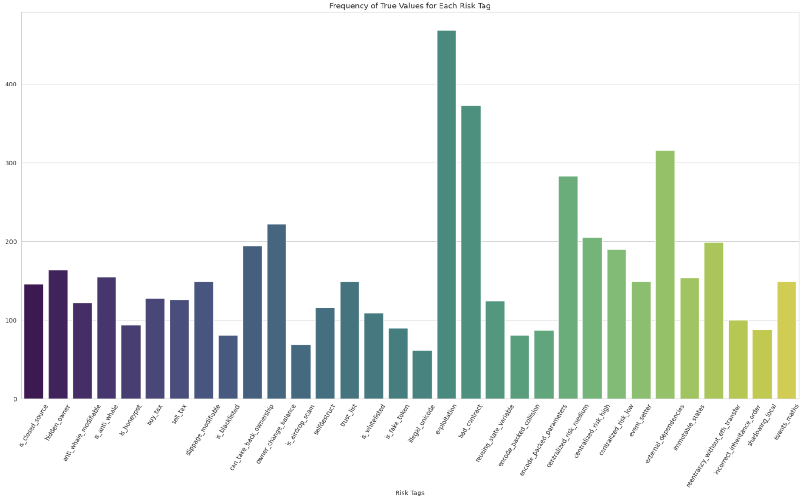

<h1> Frequency And Correlation Analysis of Smart Contract Vulnerabilities </h1>

Essential Terminology:
- __Smart Contract__: A self-executing program  stored on blockchain that automatically carries out an agreement when certain conditions are met without needing a middleman.  
  - For Example:  
    Let’s say you want to buy a digital artwork. A smart contract can be set up so that as soon as you send the payment, the artwork is automatically transferred to you. No need for a 
    third party like PayPal or a bank.
  - Smart contracts use cases are ever growing. They can be even used for something as simple as a pair of friends making a bet on which team will win a sports game.
   - Why Are They Important?  
     - No Middlemen → No banks, lawyers, or companies needed to enforce the contract
     - Transparent → Everyone can see how the contract works (no hidden rules)
     - Secure & Immutable → Once written on the blockchain, it can’t be changed or tampered with
   
- __Risk Tag__: Think of risk tags like warning labels on food—they alert you to potential dangers before you interact with a wallet or contract. These risk tags are provided by Webacy, a company that provides a security platform that helps protect crypto and NFT assets. There are a total of 32 risk_tags that we will be using. Each risk tag represents a different type of risk.
  - What do they detect?
    - Risks of a contract taking your funds through scam, hacks, or fraud
    - Hacking of your tokens
    - Suspicious activity such as involvement in shady transactions
    - Fake contracts mimicking legit ones

<h1> Part 1: Frequency Analysis </h1>

Objective: Document the occurrence rates of each risk tag across the dataset, providing a clear quantification of the most prevalent vulnerabilities.  

<h2> Frequency Analysis in Excel </h2>

<h3> Step 1: Prepare for analysis </h3>

1. To make the data easier to work with you can freeze the top row so you can always see your column headers as you scroll down. This is particularly useful with large datsets. (Go to View > Freeze Panes > Freeze Top Row.)
   
2. Create a new worksheet dedicated to the summary table. This helps keep your analysis organized and separate from the raw data.

3. In column A of the new worksheet, list all the risk tags you are analyzing. Start from A2, leaving A1 for the header "Risk Tag".

<h3> Step 2: Calculating the Frequencies and Percentages </h3>

1. Set Up Frequency Calculation
   
In column B next to each risk tag, calculate the frequency of True values.
Label column B as "Frequency of True".
For example, if the risk tag 'Is_honeypot' is in column B of a worksheet named 'Data', in B2 you would enter:
=COUNTIF(Data!B:B, TRUE)

3. Calculate Total Number of Entries

Determine the total number of entries in your dataset to use in calculating percentages.
Place this formula in a cell in the summary worksheet, for example in B1 (consider renaming it to a more descriptive cell name for clarity):
=COUNTA(Data!B2:B101) // Adjust the range as necessary
Ensure this range matches the total data entries (excluding headers).

3. Calculate the Percentage of True Values

In column C next to the frequency count, calculate the percentage that each frequency represents relative to the total number of entries.
Label column C as "Percentage of True".
In C2, you would enter:
=B2 / $B$1
Format the cells in Column C to percentage format for better readability.

4. Drag to Fill the Formulas

After entering the formulas in B2 and C2 for the first risk tag, use the fill handle to drag the formula down through the column to automatically adjust it for the remaining risk tags.
This action copies the formula while adjusting the row references accordingly but keeps the reference to the total number of entries absolute (using $ signs).

<h3> Step 3: Visualization </h3>

1. Highlight all of your frequency data including the headers.

2. Insert a Bar Chart: Go to Insert > Charts > Bar Chart and choose the first simple bar chart option. Excel will generate a bar chart displaying the frequency of True values for each risk tag.

<h3> Step 4: Findings </h3>

What are the most frequently seen risk tags?  
1. Exploitation (43%)
2. Bad_contract (34%)
3. external_dependencies (29%)

What are the least frequently seen risk tags?  
1. illegal_unicode
2. is_airdrop_scam
3. is_blacklisted

<h2> Frequency Analysis in Python </h2>

<h2> Step 1: Import the necassary libraries and load the dataset </h2>

__The libraries__:  
 
  &nbsp;&nbsp;&nbsp;&nbsp; - Pandas  
  &nbsp;&nbsp;&nbsp;&nbsp; - Matplotlib  
  &nbsp;&nbsp;&nbsp;&nbsp; - Seaborn  
   
  Download the dataset and save it into a pandas dataframe. Print the first five rive using the __.head()__ function.

<h2> Step 2: Calculating Frequencies </h2>

We'll now use pandas to count how many True values appear in each column which represents our risk tags:  

&nbsp;&nbsp;&nbsp;&nbsp; __frequencies = data[risk_columns].apply(lambda x: x.value_counts()).loc[True]__  
&nbsp;&nbsp;&nbsp;&nbsp; __frequencies = frequencies.fillna(0)__ #Replace NaN with 0 for any column that may not have True values  

<h2> Step 3: Creating Advanced Visualizations </h2>

&nbsp;&nbsp;&nbsp;&nbsp; __sns.set_style("whitegrid")__ # set a style for your chart  
&nbsp;&nbsp;&nbsp;&nbsp; __plt.figure(figsize=(12, 8))__  
&nbsp;&nbsp;&nbsp;&nbsp; __sns.barplot(x=frequencies.index, y=frequencies.values, palette='viridis')__  
&nbsp;&nbsp;&nbsp;&nbsp; __plt.title('Frequency of True Values for Each Risk Tag')__  
&nbsp;&nbsp;&nbsp;&nbsp; __plt.xlabel('Risk Tags')__  
&nbsp;&nbsp;&nbsp;&nbsp; __plt.ylabel('Frequency of True')__  
&nbsp;&nbsp;&nbsp;&nbsp; __plt.xticks(rotation=90)__  
&nbsp;&nbsp;&nbsp;&nbsp; __plt.show()__  

